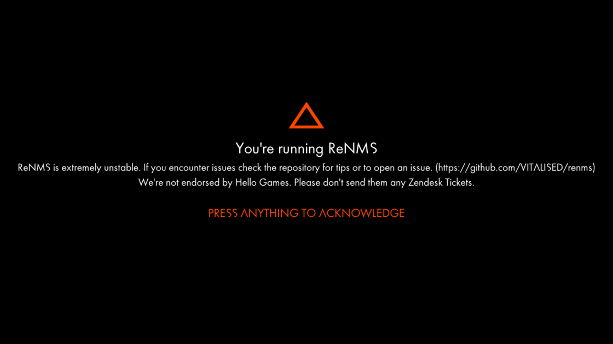

# ReNMS

## Overview

ReNMS is a No Man's Sky SDK featuring a high-level type framework for working with NMS (or frankly the Skyscraper engine in general if it's ever planned on being reused). Supports a Python scripting framework which you can use to run our SDK embedded or to use monkeyman's [NMS.py](https://github.com/monkeyman192/NMS.py) if you prefer. If you're more technical and like messing around with memory in a real man's language we also have dynamic library loading supported too, although it's not super field tested yet (please get in touch!!!).

## Installing

There are no current prebuilt binaries, this will change when we reach a more stable state. You can of course build the project yourself.

## Building

See [BUILD.md](BUILD.md) for instructions.

## Development State

The project currently only builds for Fractal 4.13 on GOG. Will be ported to OSX (yes I'll add archive mounting from FS) at some point. Supporting future versions of NMS is planned sometime after the 2023 expected expedition redux missions.

Toolkit types are in a fairly usable state, minus some mystery containers and miscellaneous rarely used data structures. Most of the work spent right now is getting GcApplication to play nice.

We mostly live unofficially in the [No Man's Sky Retro discord](https://discord.gg/tEYNuMmAvR) but please don't come here for tech support. You can join our new somewhat official discord if you'd like to get in touch directly, or are just interested in development [here](https://discord.gg/SbEQFsJxNV)

## Contributing / Plugin Dev

Contributions are always welcome, there are more types in this engine than planets in the bloody game. We're also always down to support extra platforms too if you have the know-how as well.

Documentation for plugins isn't planned for some time, mostly because it's too time consuming when there are so many types to reverse.

If all this type cut-and-paste stuff is too boring for you to feel bothered to contribute to, we're also looking for shader-smart people to help reverse NMS' Horde3d shader parser. (see [this file](https://github.com/horde3d/Horde3D/blob/master/Horde3D/Source/Horde3DEngine/egShader.cpp#L495) for some context.)

## Some useful links

* [Horde3D](https://github.com/horde3d/Horde3D/)
* [Somewhat recent NMS shader source](https://github.com/EthanRDoesMC/NMS-ShaderCode)
* 